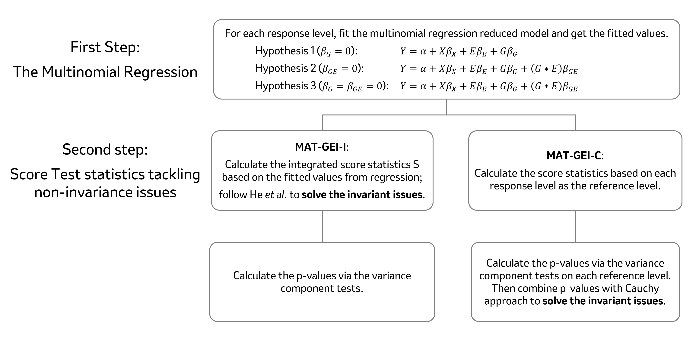

# MATGEI

MAT-GEI is a genotype-environment test with a multinomial association random effect. The MAT-GEI model considers genotype and GEI effects, efficiently handling GWAS data with a multinomial response. It constructs a novel variance component score statistic that is symmetric by considering all possible categorical phenotypes as baselines. MAT-GEI's framework comes from a recent study that theoretically proved the non-invariance issues arising from randomly selecting baseline levels for score tests with random effects [He et al., 2021](https://pmc.ncbi.nlm.nih.gov/articles/PMC9209005/).



## Installation
```r
# install.packages("devtools")
devtools::install_github("mqzhanglab/MATGEI", build_vignettes = TRUE)
```

## Documents

- Call `vignette("MATGEI")` to see a short introduction.
- See [here](https://github.com/mqzhanglab/MATGEI) for examples on data analysis. 
